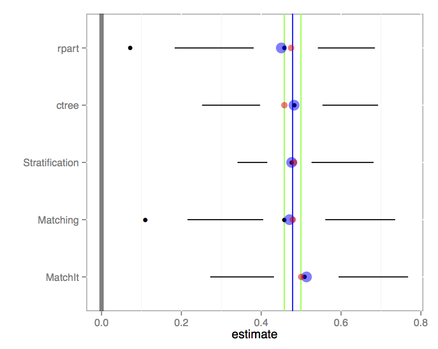
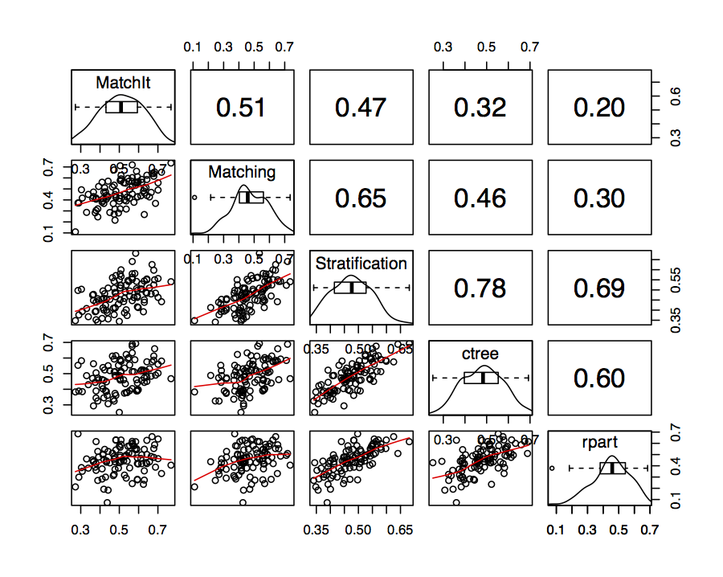

#### An R Package for Bootstrapping Propnesity Score Analysis

The `PSAboot` package provides functions to bootstrap propensity score analysis and matching.

* [Package Vignette](http://htmlpreview.github.io/?https://github.com/jbryer/PSAboot/blob/master/inst/doc/PSAboot.html)
* [useR! 2014 Talk Slides](https://github.com/jbryer/PSAboot/blob/master/Slides/Slides.pdf?raw=true)

----------

