<!--
%\VignetteEngine{knitr::knitr}
%\VignetteIndexEntry{Bootstrapping for Propensity Score Analysis}
-->

# Bootstrapping for Propensity Score Analysis

## Jason M. Bryer [jason@bryer.org](mailto:jason@bryer.org)
#### Project website: [jason.bryer.org/PSAboot](http://jason.bryer.org/PSAboot)
#### Bug Reports: [github.com/jbryer/PSAboot](https://github.com/jbryer/PSAboot)


# Abstract

As the popularity of propensity score methods for estimating causal effects in observational studies increase, the choice of specific method has also increased. Rosenbaum (2012) has suggested that there are substantial benefits for testing a hypothesis more than once. Moreover, with the wide availability of high power computers resampling methods such as bootstrapping (Efron, 1979) have become popular for providing more stable estimates of the sampling distribution. This paper introduces the `PSAboot` package for R that provides functions for bootstrapping propensity score methods. It deviates from traditional bootstrapping methods by allowing for different sampling specifications for treatment and control groups. Additionally, this framework will provide estimates using multiple methods for each bootstrap sample. Two examples are discussed: the classic National Work Demonstration and PSID (Lalonde, 1986) study and a study on tutoring effects on student grades.

-----------------------------

# Introduction

The latest version of the `PSAboot` package can be downloaded from Github using the `devtools` package.


```r
devtools::install_github("PSAboot", "jbryer")
```


The `PSAboot` function will perform the actual bootstrapping. It has a number of parameters for to specify how the bootstrap samples are drawn.

* `Tr` - a numeric (0 for control and 1 for treatment) or logical vector of treatment indicators.
* `Y` - a numeric vector with the outcome of interest.
* `X` - a data frame of covaraites.
* `M` (default is 100) - the number of bootstrap samples to draw.
* `formu` - the formula for estimating the propensity scores in phase I. Note that the dependent variable does not need to be specified as it will be replaced when combining the `Tr` vector and `X` data frame.
* `control.ratio` (default is 5) - This specifies the sample size of control units as a ratio of treatment units. For example, with a default value of 5 and 100 treatment units, this methods will sample 500 control units for each sample, or the number of control units if smaller than 500. When the ratio of treatment-to-control units increases, the range of propensity scores (using logistic regression) shrinks. Randomly selecting a subset of control units often results in wider and better overlapping distribution of propensity scores. See the the [`PSranges`](http://jason.bryer.org/multilevelPSA/psranges.html) function in the [`multilevelPSA`](http://jason.bryer.org/multilevelPSA) package for more information or this page: [http://jason.bryer.org/multilevelPSA/psranges.html](http://jason.bryer.org/multilevelPSA/psranges.html).
* `control.sample.size` (default is 5 times the number of treatment units) - The number of control units to sample for each bootstrap sample. If specified, this overrides the `control.ratio` parameter.
* `control.replace` (default is `TRUE`) - Specify whether random sampling of control units does so with replacement.
* `treated.sample.size` (default is the number of treatment units) - The number of treatment units to sample for each bootstrap sample.
* `treated.replace` (default is `TRUE`) - Specify whether random sampling of treatment units does so with replacement.
* `methods` - A list of functions to perform a propensity score analysis for each bootstrap sample. See the methods section below.
* `parallel` (default is `TRUE`) - Whether the bootstrapping procedure should be run in parallel.
* `seed` - Seed used for the random number generator. If specified, the random seed will be set to `seed + i` where `i` is the current bootstrap sample in (1, M).

Other parameters can be passed to `methods` using the `...` parameter.

## Methods

The `methods` parameter on the `PSAboot` function specifies the different propensity score methods that will be used. Specifically, for each bootstrap sample drawn, each function will be called. This allows for a comparison of methods across all bootstrap samples. Five methods are included, they are:

* `boot.strata` - This method estimates propensity scores using logistic regression and stratifies using quintiles on the propensity scores. Effects within each strata are estimated and aggregated.
* `boot.ctree` - This method creates strata using conditional inference trees vis-a-vis the `ctree` function in the `party` package. Effects within each strata (i.e. leaf node) are estimated and aggregated.
* `boot.rpart` - This method creates strata using classification trees vis-a-vis the `rpart` function. Effects within each strata (i.e. leaf node) are estimated and aggregated.
* `boot.matching` - This method finds matched pairs using the `Match` function in the `Matching` package. A paired dependent sample t-test is used to estimate effect sizes.
* `boot.matchit` - This method finds match pairs using the `matchit` function in the `MatchIt` package. A paired dependent sample t-ttest is used to estimate effect sizes.

### Defining Custom Methods

It is possible to define a custom method. Each method is a function with, at minimum, the following six parameters:

* `Tr` - A logical or integer (0 and 1) vector with treatment indicators.
* `Y` - A numeric vector representing the outcome.
* `X` - A data frame with the covariates.
* `X.trans` - A data frame with factor levels dummy coded.
* `formu` - A formula for estimating propensity scores in phase one.
* `...` - Other parameters passed through from the `PSAboot` function.

Each method must return a `list` with three elements:

* `summary` - This must be a named numeric vector with at minimum `estimate`, `ci.min`, and `ci.max`, however other values allowed.
* `balance` - This must be a named numeric vector with one element per covariate listed in `X.trans` representing a balance statistic. It is recommended, and the implementation for the built-in methods, to use an absolute standardized effect size. As will be shown below, the summary and plotting functions will include an adjusted balance statistic (i.e. effect size) before adjustment for comparison.
* `details` - This can be an arbitrary object, typically the result of the underlying method used.

For example, the `boot.matching.1to3` function below wraps the built-in `boot.matching` method but sets the `M` parameter to 3, thereby performing 1-to-3 matching instead of the default 1-to-1 matching. This framework simplifies the process of using, and comparing, slight variations of different propensity score methods. 


```r
boot.matching.1to3 <- function(Tr, Y, X, X.trans, formu, ...) {
    return(boot.matching(Tr = Tr, Y = Y, X = X, X.trans = X.trans, formu = formu, 
        M = 3, ...))
}
```


The `PSAboot` function returns an object of class `PSAboot`. The following S3 methods are implemented: `print`, `summary`, `plot`, `boxplot`, and `matrixplot`.

-----------------------------

# Example One: National Work Demonstration and PSID

The `lalonde` (Lalonde, 1986) has become the *de defacto* teaching dataset in PSA since Dehejia and Wahba's (1999) re-examination of the National Supported Work Demonstration (NSW) and the Current Population Survey (CPS). 

The `lalonde` data set is included in the `MatchIt` package. The crosstab shows that there are 429 control units and 185 treatment units.


```r
data(lalonde, package = "MatchIt")
table(lalonde$treat)
```

```

  0   1 
429 185 
```


```r
lalonde.formu <- treat ~ age + I(age^2) + educ + I(educ^2) + black + hispan + 
    married + nodegree + re74 + I(re74^2) + re75 + I(re75^2) + re74 + re75
boot.lalonde <- PSAboot(Tr = lalonde$treat, Y = lalonde$re78, X = lalonde, formu = lalonde.formu, 
    M = boot.M, seed = 2112)
```

```
50 bootstrap samples using 5 methods.
Bootstrap sample sizes:
   Treated=185 (100%) with replacement.
   Control=429 (100%) with replacement.
```


The `summary` function provides numeric results for each method including the overall estimate and confidence interval using the complete sample as well as the pooled estimates and confidence intervals with percentages of the number of confidence intervals that do not span zero.


```r
summary(boot.lalonde)
```

```
Stratification Results:
   Complete estimate = 550
   Complete CI = [-1168, 2269]
   Bootstrap pooled estimate = 580
   Bootstrap pooled CI = [-1215, 2376]
   18% of bootstrap samples have confidence intervals that do not span zero.
      16% positive.
      2% negative.
ctree Results:
   Complete estimate = 169
   Complete CI = [-1552, 1891]
   Bootstrap pooled estimate = 500
   Bootstrap pooled CI = [-1656, 2656]
   22% of bootstrap samples have confidence intervals that do not span zero.
      16% positive.
      6% negative.
rpart Results:
   Complete estimate = -875
   Complete CI = [-2567, 816]
   Bootstrap pooled estimate = -959
   Bootstrap pooled CI = [-4271, 2352]
   26% of bootstrap samples have confidence intervals that do not span zero.
      2% positive.
      24% negative.
Matching Results:
   Complete estimate = -606
   Complete CI = [-1296, 83.2]
   Bootstrap pooled estimate = -674
   Bootstrap pooled CI = [-2960, 1612]
   76% of bootstrap samples have confidence intervals that do not span zero.
      14% positive.
      62% negative.
MatchIt Results:
   Complete estimate = 617
   Complete CI = [-839, 2072]
   Bootstrap pooled estimate = 166
   Bootstrap pooled CI = [-1375, 1708]
   6% of bootstrap samples have confidence intervals that do not span zero.
      2% positive.
      4% negative.
```


The `plot` function plots the estimate (mean difference) for each bootstrap sample. The default is to sort from largest to smallest estimate for each method separately. That is, rows do not correspond across methods. The `sort` parameter can be set to `none` for no sorting or the name of any `method` to sort only based upon the results of that method. In these cases the rows then correspond to matching bootstrap samples. The blue points correspond to the the estimate for each bootstrap sample and the horizontal line to the confidence interval. Confidence intervals that do not span zero are colored red. The vertical blue line and green lines correspond to the overall pooled estimate and confidence for each method, respectively.


```r
plot(boot.lalonde)
```

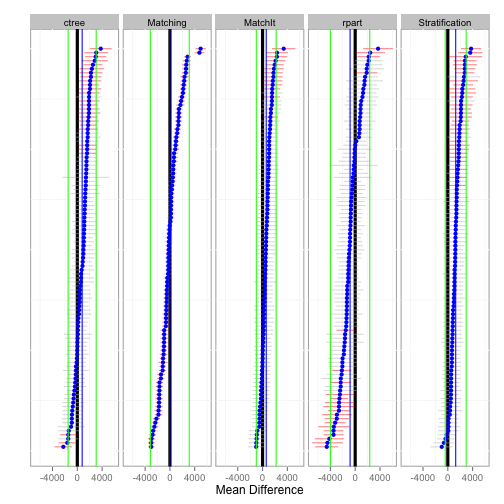 


The `hist` function plots a histogram of the estimates across all bootstrap samples for each method.


```r
hist(boot.lalonde)
```

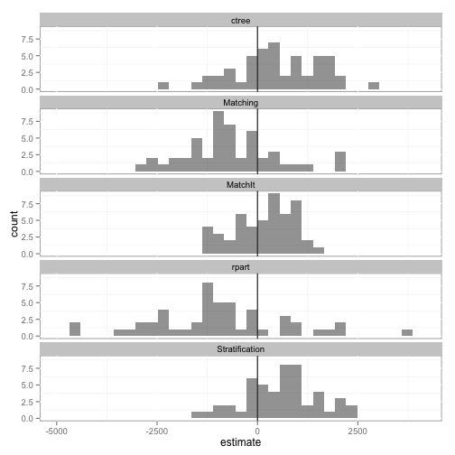 


The `boxplot` function depicts the distribution of estimates for each method along with confidence intervals in green. Additionally, the overall pooled estimate and confidence interval across all bootstrap samples and methods are represented by the vertical blue and green lines, respectively.


```r
boxplot(boot.lalonde)
```

```
Loading required package: ggthemes
```

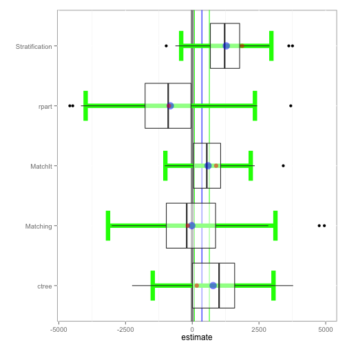 


The `matrixplot` summarizes the estimates across methods for each bootstrap sample. The lower half of the matrix are scatter plots where each point represents the one bootstrap sample. The red line is a Loess regression line. The main diagonal depicts the distribution of effects and the upper half provides the correlation of estimates. In the following example we see that the `ctree` and `Stratification` methods have the strongest agreement with a correlation of 0.63 whereas the `rpart` and `MatchIt` methods have the least agreement with a correlation of 0.22.


```r
matrixplot(boot.lalonde)
```

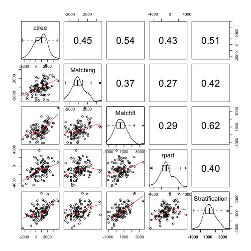 


## Evaluating Balance

The strength of propensity score analysis relies on achieving good balance. Typically one would evaluate each covariate separately to ensure that sufficient balance has been achieved. We recommend Helmreich and Pruzek (2009) for a more complete discussion of visualizations to evaluate balance. Given the large number of samples and methods used, it is desirable to have a single metric to evaluate balance. Drawing on the principles of the multiple covariate balance assessment plot (Helmreich & Pruzek, 2009), the `balance` function will estimate the effect of each covariate before and after adjustment. Moreover, to provide a single metric for each sample and method, the mean standardized effect size will be used.


```r
lalonde.bal <- balance(boot.lalonde)
lalonde.bal
```

```
Unadjusted balance: 0.443234083160092
               Complete Bootstrap
Stratification   0.1487    0.1385
ctree            0.2013    0.1653
rpart            0.2938    0.2873
Matching         0.1296    0.1853
MatchIt          0.2787    0.2749
```


The `plot` function provides density plots of the balance statistics across all bootstrap samples for each method. The mean overall balance is represented by the vertical black lines, the overall balance for the complete dataset is represented by the vertical blue line, and the adjusted balance is represented by the vertical red line. Although no specific guidelines are recommended in the literature, achieving a balance of less than 0.1 is desirable. In this example we see that PSA has reduce the bias in all methods although `rpart`, and to a lesser extent `MatchIt`, did not reduce the bias by as much as would be typically desired.


```r
plot(lalonde.bal)
```

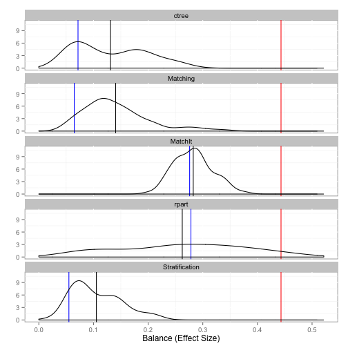 


The `boxplot` function provides a more nuanced depiction of the balance by separating on the distribution of balance statistics by individual covariate. In addition to the boxplot of balance statistics, the mean balance statistic is represented by the blue point and the unadjusted balance statistic by the red point. We see that the largest imbalance was in the `black`, `married`, and `re74` (real earnings in 1974) before adjustment. All of the estimates reduced the bias in these covariates although it is worth noting that the `MatchIt` method did not reduce the bias in the `black` covariate to a desirable level.

This figure, in conjunction with the density plot above, show that the relatively large mean balance for `rpart` is likely due to some outlier samples where the adjusted balance for `educ`, `re75`, and `hispan` are fairly large. It should be noted that with these exceptions, balance for each covariates are generally less than the unadjusted balance.


```r
boxplot(lalonde.bal)
```

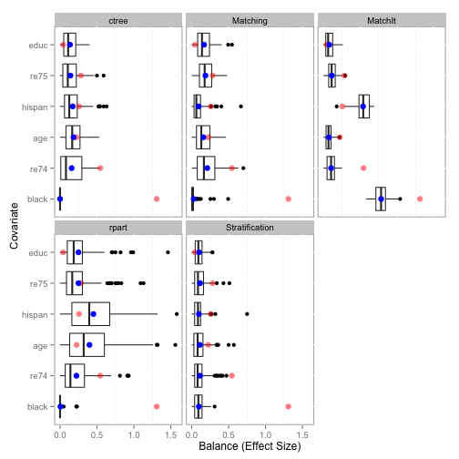 


-----------------------------

# Example Two: Effectiveness of Tutoring on Course Grades

This example utilizes a dataset in the `TriMatch` package that provides student data in online English courses. The original study examined the effects of tutoring on English course grades. In the original study two treatments were defined, those who used tutoring services once and those who used tutoring services two or more times during the course term. The outcome of interest was course grade (0=F, 1=D, 2=C, 3=B, 4=A). For our purposes here we will consider only one treatment group: students who used tutoring services at least once during the course. 


```r
require(TriMatch)
```

```
Loading required package: TriMatch
Loading required package: scales
Loading required package: reshape2
Loading required package: ez
```

```r
require(PSAboot)
data(tutoring, package = "TriMatch")
tutoring$treatbool <- tutoring$treat != "Control"
covs <- tutoring[, c("Gender", "Ethnicity", "Military", "ESL", "EdMother", "EdFather", 
    "Age", "Employment", "Income", "Transfer", "GPA")]

table(tutoring$treatbool)
```

```

FALSE  TRUE 
  918   224 
```


```r
tutoring.boot <- PSAboot(Tr = tutoring$treatbool, Y = tutoring$Grade, X = covs, 
    seed = 2112, M = boot.M, control.sample.size = 918, control.replace = TRUE, 
    treated.sample.size = 224, treated.replace = TRUE, methods = c(Stratification = boot.strata, 
        ctree = boot.ctree, rpart = boot.rpart, Matching = boot.matching, `Matching-1-to-3` = boot.matching.1to3, 
        MatchIt = boot.matchit))
```

```
50 bootstrap samples using 6 methods.
Bootstrap sample sizes:
   Treated=224 (100%) with replacement.
   Control=918 (100%) with replacement.
```

```r
summary(tutoring.boot)
```

```
Stratification Results:
   Complete estimate = 0.482
   Complete CI = [0.3, 0.665]
   Bootstrap pooled estimate = 0.485
   Bootstrap pooled CI = [0.342, 0.628]
   100% of bootstrap samples have confidence intervals that do not span zero.
      100% positive.
      0% negative.
ctree Results:
   Complete estimate = 0.458
   Complete CI = [0.177, 0.739]
   Bootstrap pooled estimate = 0.489
   Bootstrap pooled CI = [0.315, 0.662]
   100% of bootstrap samples have confidence intervals that do not span zero.
      100% positive.
      0% negative.
rpart Results:
   Complete estimate = 0.475
   Complete CI = [0.165, 0.784]
   Bootstrap pooled estimate = 0.458
   Bootstrap pooled CI = [0.208, 0.709]
   86% of bootstrap samples have confidence intervals that do not span zero.
      86% positive.
      0% negative.
Matching Results:
   Complete estimate = 0.479
   Complete CI = [0.388, 0.571]
   Bootstrap pooled estimate = 0.487
   Bootstrap pooled CI = [0.259, 0.715]
   100% of bootstrap samples have confidence intervals that do not span zero.
      100% positive.
      0% negative.
Matching-1-to-3 Results:
   Complete estimate = 0.472
   Complete CI = [0.411, 0.533]
   Bootstrap pooled estimate = 0.481
   Bootstrap pooled CI = [0.326, 0.637]
   100% of bootstrap samples have confidence intervals that do not span zero.
      100% positive.
      0% negative.
MatchIt Results:
   Complete estimate = 0.513
   Complete CI = [0.264, 0.762]
   Bootstrap pooled estimate = 0.529
   Bootstrap pooled CI = [0.315, 0.742]
   100% of bootstrap samples have confidence intervals that do not span zero.
      100% positive.
      0% negative.
```


```r
plot(tutoring.boot)
```

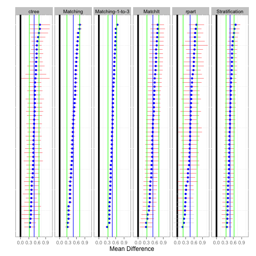 


```r
hist(tutoring.boot)
```

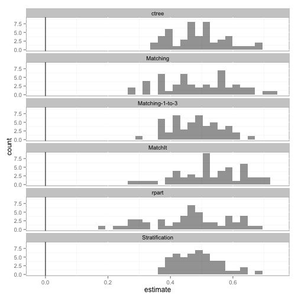 


```r
boxplot(tutoring.boot)
```

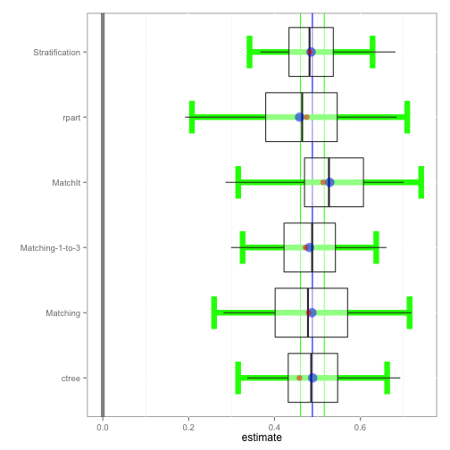 


```r
matrixplot(tutoring.boot)
```

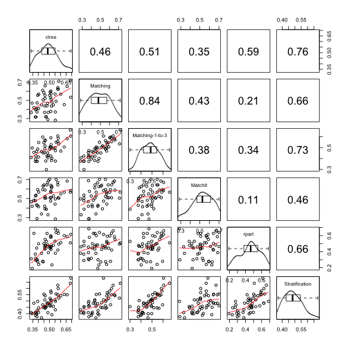 


```r
tutoring.bal <- balance(tutoring.boot)
tutoring.bal
```

```
Unadjusted balance: 0.117875835338968
                Complete Bootstrap
Stratification   0.02923   0.03725
ctree            0.04385   0.06875
rpart            0.07846   0.08800
Matching         0.04522   0.06546
Matching-1-to-3  0.03055   0.05237
MatchIt          0.05078   0.05651
```

```r
plot(tutoring.bal)
```

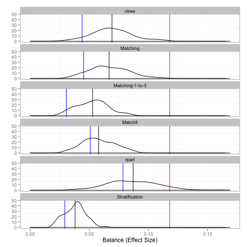 

```r
boxplot(tutoring.bal)
```

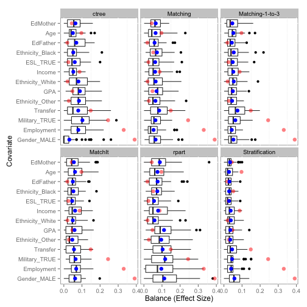 


-----------------------------

# References

Bryer, J.M. (2013). TriMatch: Propensity Score Matching of Non-Binary Treatments. R package version 0.9.1. http://jason.bryer.org/TriMatch

Helmreich, J.E., Pruzek, R.M. (2009). PSAgraphics: An R Package to Support Propensity Score Analysis. Journal of Statistical Software 29(6), 1-23. http://www.jstatsoft.org/v29/i06/.

Ho, D.E., Imai, K., King, G., & Stuart, E.A. (2011). MatchIt: Nonparametric Preprocessing for Parametric Causal Inference. Journal of Statistical Software, (42) 8, 1-28. URL http://www.jstatsoft.org/v42/i08/

Hothorn, T., Hornik, K., & Zeileis, A. (2006). Unbiased Recursive Partitioning: A Conditional Inference Framework. Journal of Computational and Graphical Statistics, 15(3), 651-674.

Lalonde, R. (1986). Evaluating the econometric evaluations of training programs with experimental data. American Economic Review 76: 604-620.

Dehejia, R.H. and Wahba, S. (1999). Causal Effects in Nonexperimental Studies: Re-Evaluating the Evaluation of Training Programs. Journal of the American Statistical Association 94: 1053-1062.

R Core Team (2013). R: A language and environment for statistical computing. R Foundation for Statistical Computing, Vienna, Austria. URL http://www.R-project.org/.

Rosenbaum, P.R. (2012). Testing one hypothesis twice in observational studies. Biometrika, 99, 4, 763-774.

Rosenbaum, P.R., & Rubin, D.B. (1983). The central role of the propensity score in observational studies for causal effects. Biometrika, 70, 1, 41-55.

Sekhon, J.S. (2011). Multivariate and Propensity Score Matching Software with Automated Balance Optimization: The Matching Package for R. Journal of Statistical Software, 42(7), 1-52. URL http://www.jstatsoft.org/v42/i07/.

Therneau, T., Atkinson, B., & Ripley, B. (2013). rpart: Recursive Partitioning. R package version 4.1-3. http://CRAN.R-project.org/package=rpart

